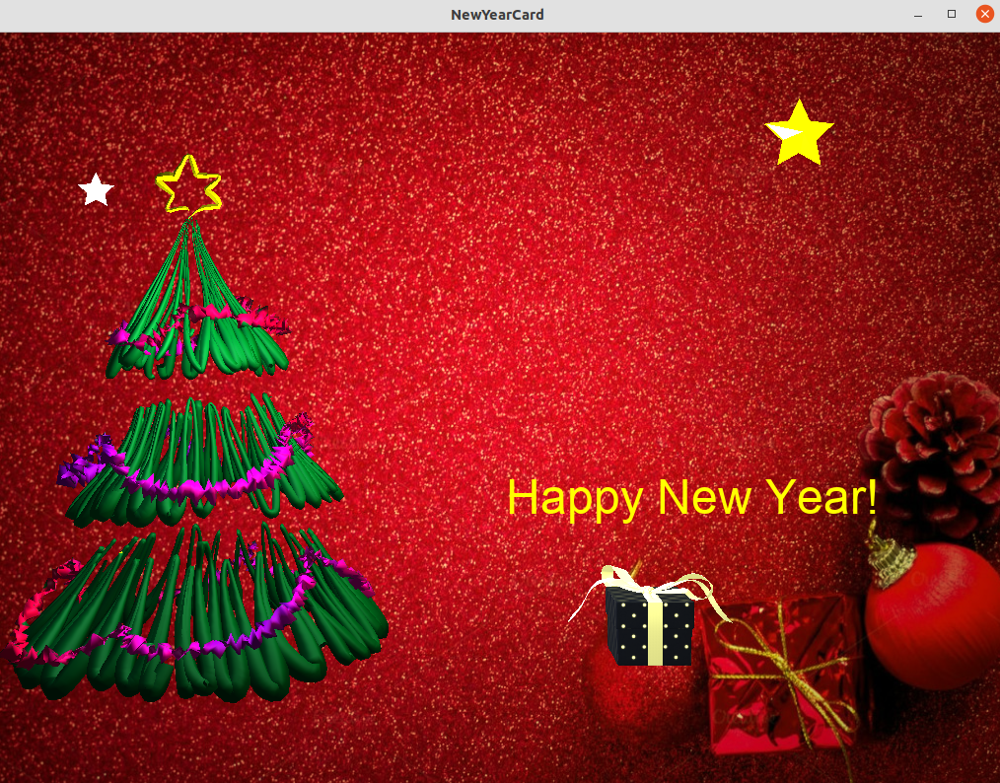
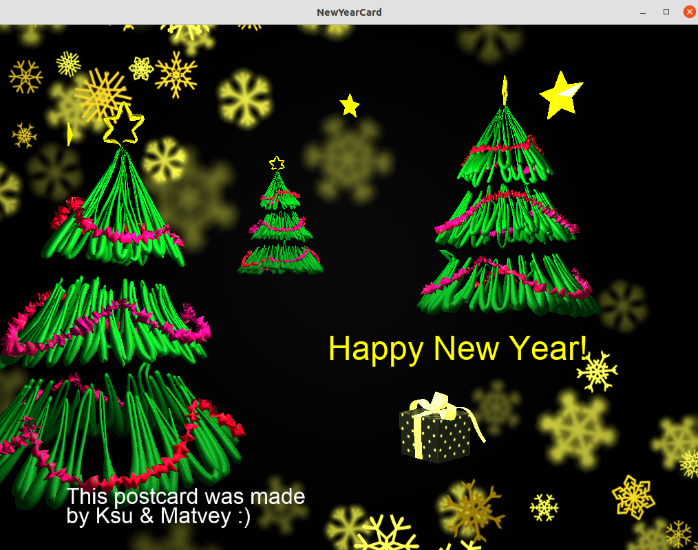

# QR_postcards

> **QR_postcards** - это онлайн-редактор новогодних 3D открыток. 

Открытка описывается на языке разметки "Congratulator" в текстовом документе, который указывается в качестве параметра командной строки при запуске программы.

 ### Пример программ на "Congratulator"

Программа в файле program.txt
```
$ cat program.txt

background[5];

pine[20,10]
    {
     size=3;
     intense=3;
    }

star[80,80]
    {
     color=blue;
     size=2;
     intense=1;
    }

gift[65,20]
    {
     size=2;
     color=white;
     intense=1;
    }

congrat [52,40]
    {
     color=yellow;
     size=3;
     +"Happy New Year!";
    }

  ```
Открытка 

  


 ### Синтаксис:

Очень простой:

+ Объекты
  + pine
  + star
  + gift
  + congrat

+ Координаты объекта \[x, y\]  

  + x и у от 0 до 100

+ Размер size = n

  + n от 1 до 5 

+ Интенсивность вращения intense = n

  + n от 1 до 5  

+ Цвета color = c

  + с один из (blue, white, yellow, violet, red)  

+ Фон n

  + n от 1 до 5  


-----------------------------------------------------------------------------


 ### Сборка проекта:  

```
  $ git clone git@github.com:matmuher/QR_postcards.git
  $ cd OpenGL
  $ make
  $ cd src
  $ ./OpenGL ma_card.txt
```

 #### Интерактивный режим

```
  $ ./OpenGL 
  $
  $star[80,80]
  $  {
  $  color=yellow;
  $  size=2;
  $  intense=5;
  $  }
  $  // отправить Ctrl+D
```


 Чтобы удалить объектные файлы:  
```
  $ cd OpenGL
  $ make clean
```

Для закрытия окна нажать **esc**


### Добавим побольше всего и поменяем фон

  


